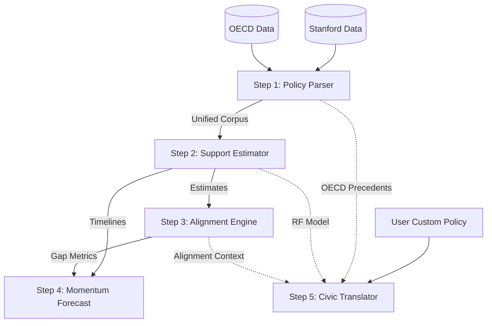
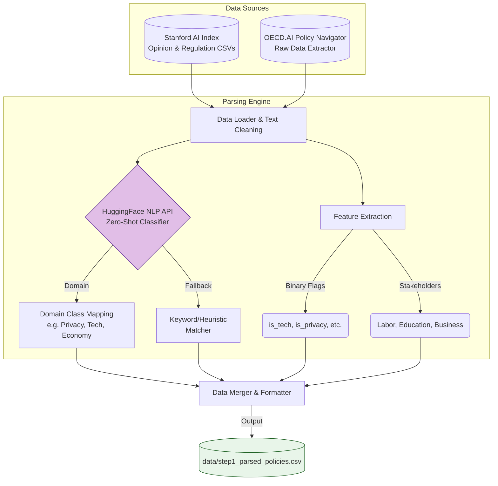
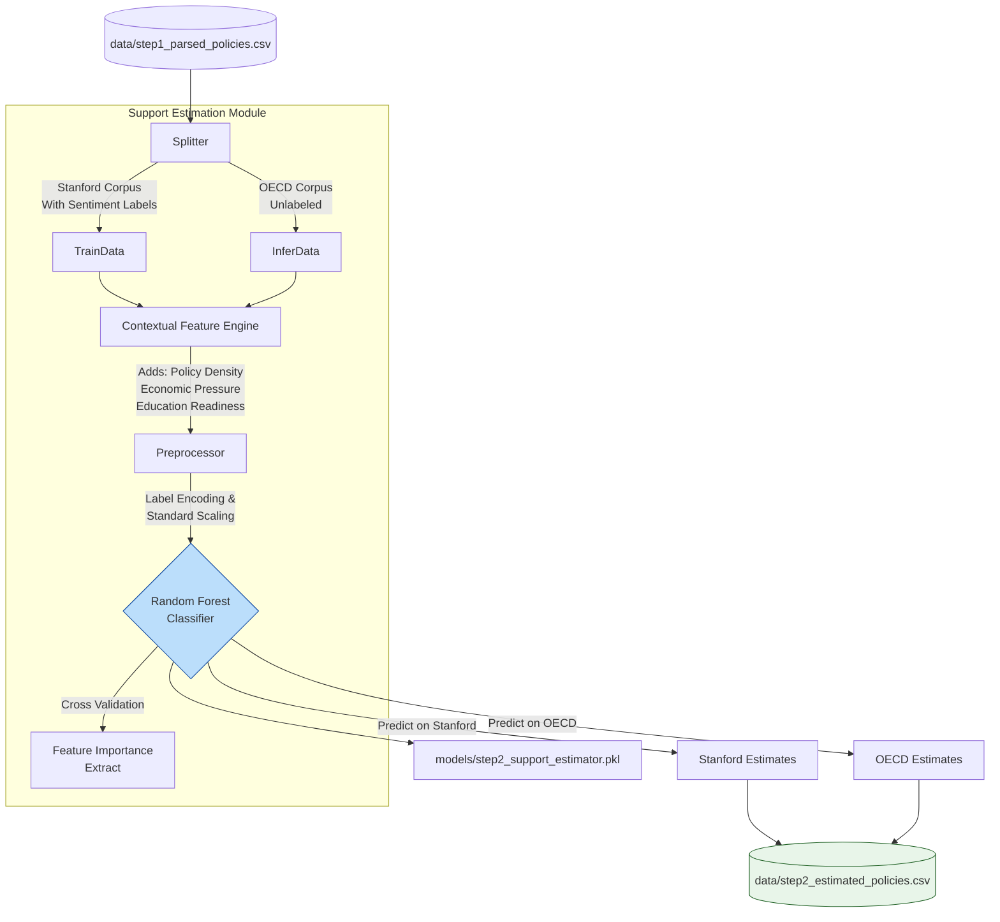
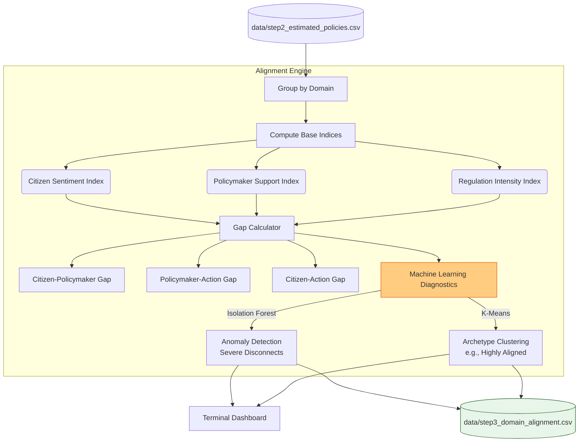
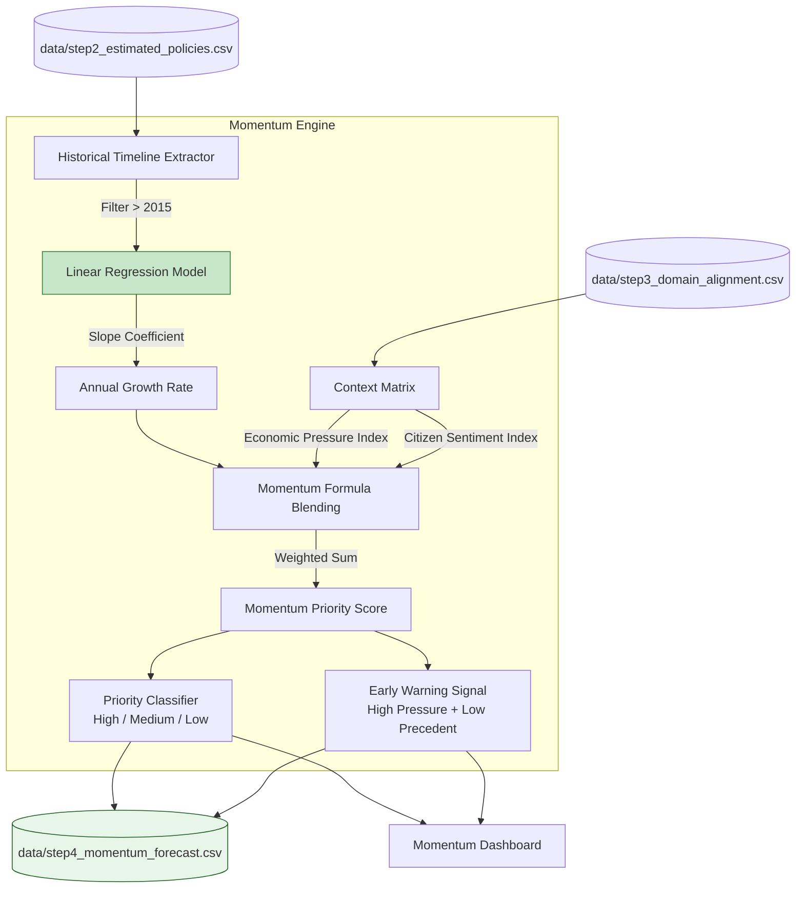
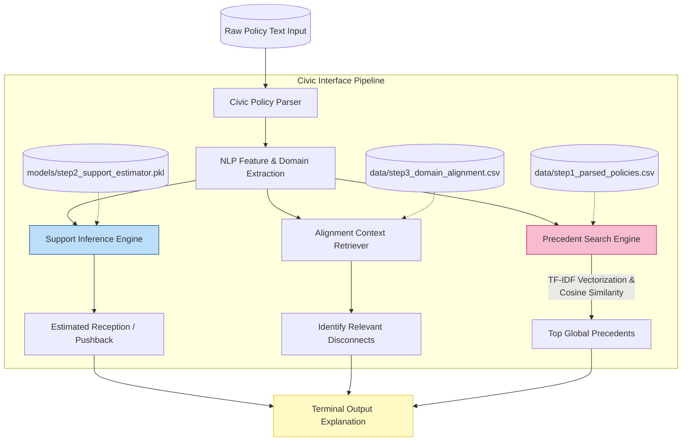

# AI Civic Alignment System: Detailed Architecture

This document contains a high-level overview of the entire system, followed by detailed, component-level Mermaid flowcharts for each of the 5 pipeline steps.

---

## High-Level System Overview

---

## Detailed Step Breakdowns

### Step 1: Policy Parsing Engine
The data ingestion and NLP tagging layer to build a unified corpus.

---

### Step 2: Policymaker Support Estimation
The supervised ML module that learns from Stanford data to predict on OECD data.

---

### Step 3: Alignment Engine (Core Gap Analysis)
The centerpiece of the platform. Computes misalignment gaps and runs unsupervised diagnostic models.

---

### Step 4: Regulation Momentum Forecast
A time-series and regression engine forecasting regulatory shifts.

---

### Step 5: Policy Translator (Civic Interface)
The civic-facing application to democratize understanding of new AI proposals.

