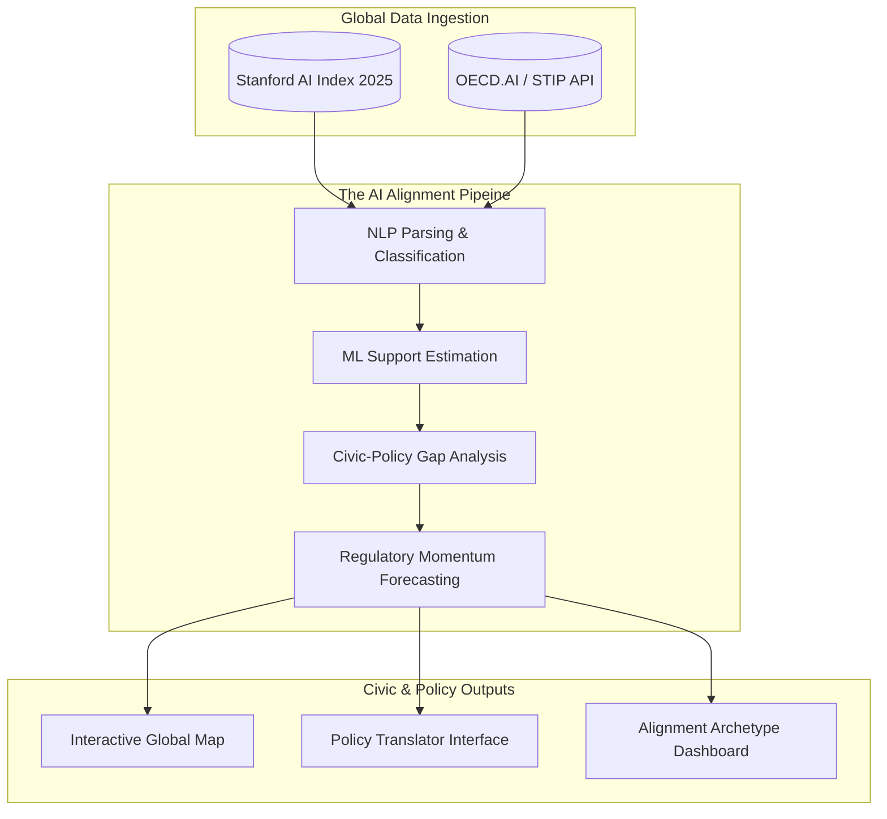
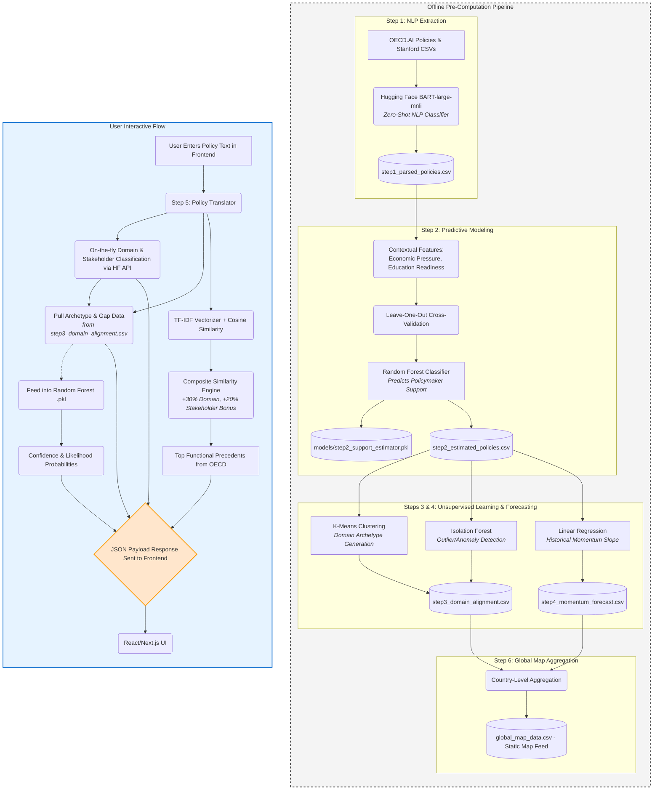

# AI Civic Alignment System: Workflow Visualizations

You can paste the code blocks below directly into [Mermaid Live Editor](https://mermaid.live/) to generate high-resolution diagrams for your presentation slides.

## 1. High-Level Conceptual Overview
*Describes the flow from raw global data to civic impact.*

---

## 2. Detailed Technical Pipeline & Data Flow
*A deep dive into the ML architecture, data transformations, and the interactive frontend payload path.*

