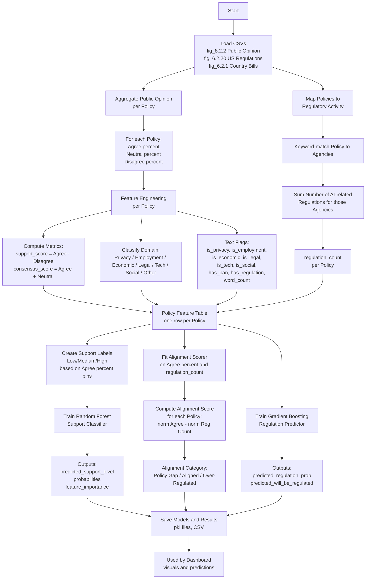
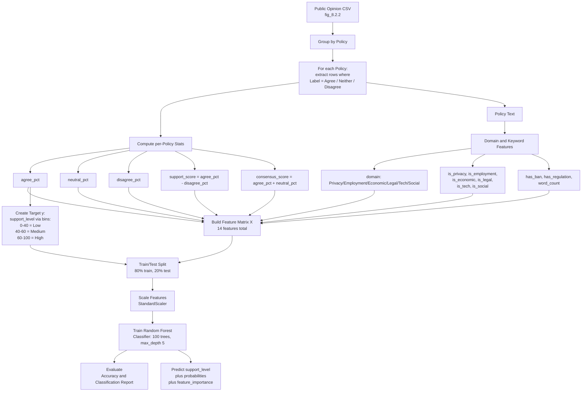
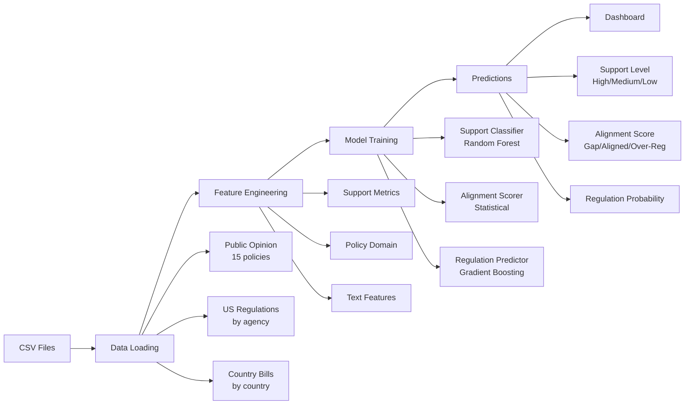

# Data Pipeline Flowcharts

## Complete Backend Pipeline



---

## Model 1: Policy Support Classification (Detailed)



---

## Simplified High-Level View



---

## Alternative: ASCII Flowchart (if Mermaid still has issues)

```
┌─────────────────────────────────────────────────────────────┐
│                    DATA PIPELINE OVERVIEW                    │
└─────────────────────────────────────────────────────────────┘

1. DATA LOADING
   ├─ fig_8.2.2.csv (Public Opinion)
   │  └─ 15 policies × 3 labels = 45 rows
   ├─ fig_6.2.20.csv (US Regulations)
   │  └─ Regulations by agency and year
   └─ fig_6.2.1.csv (Country Bills)
      └─ Bills passed by country (2016-24)

2. FEATURE ENGINEERING
   ├─ Per Policy:
   │  ├─ agree_pct, neutral_pct, disagree_pct
   │  ├─ support_score = agree_pct - disagree_pct
   │  ├─ consensus_score = agree_pct + neutral_pct
   │  ├─ domain (Privacy/Employment/Economic/Legal/Tech/Social)
   │  └─ Binary flags (is_privacy, is_employment, etc.)
   └─ Regulatory Activity:
      └─ regulation_count (from keyword matching)

3. MODEL TRAINING
   ├─ Model 1: Support Classifier
   │  ├─ Algorithm: Random Forest (100 trees)
   │  ├─ Input: 14 features
   │  ├─ Output: High/Medium/Low support level
   │  └─ Target: Binned agree_pct (0-40=Low, 40-60=Med, 60-100=High)
   │
   ├─ Model 2: Alignment Scorer
   │  ├─ Algorithm: Normalized score calculation
   │  ├─ Formula: norm(agree_pct) - norm(regulation_count)
   │  └─ Output: Policy Gap / Aligned / Over-Regulated
   │
   └─ Model 3: Regulation Predictor
      ├─ Algorithm: Gradient Boosting
      ├─ Input: 14 features
      └─ Output: Probability of regulation (0-1)

4. PREDICTIONS & OUTPUTS
   ├─ policy_alignment_data.csv (all predictions)
   ├─ policy_support_model.pkl (saved model)
   └─ regulation_predictor_model.pkl (saved model)

5. DASHBOARD USAGE
   └─ Visualizations and interactive predictions
```
