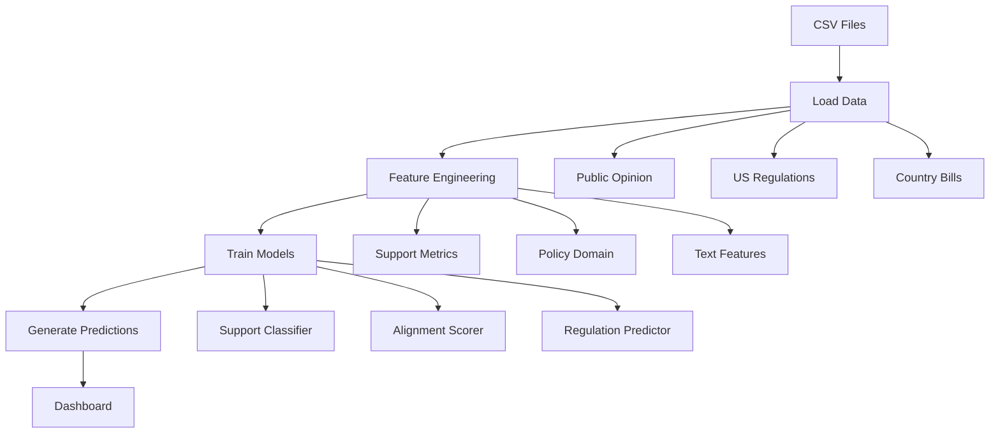
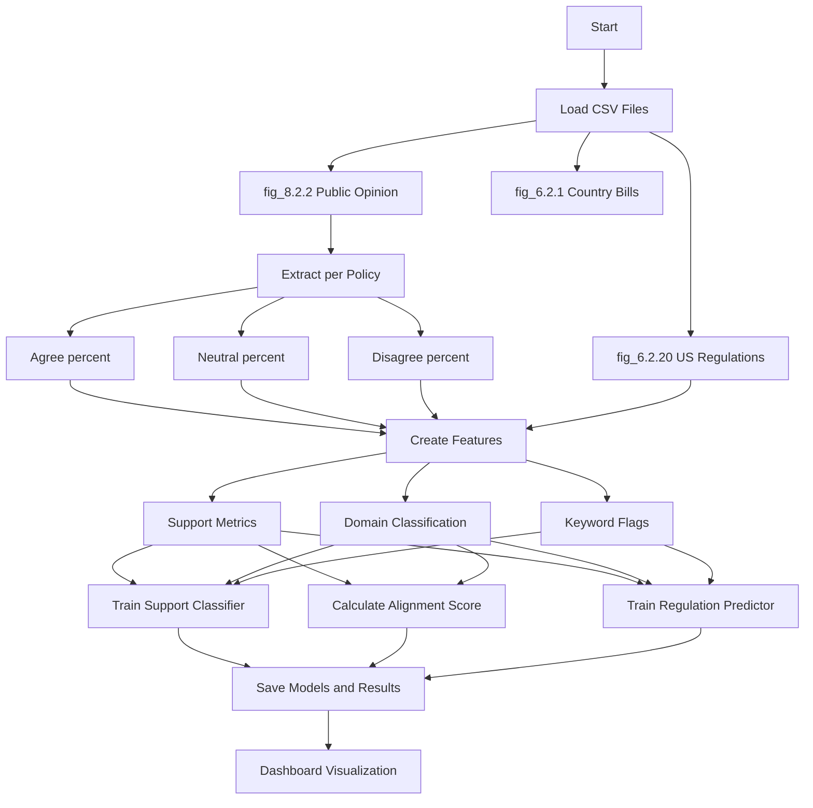
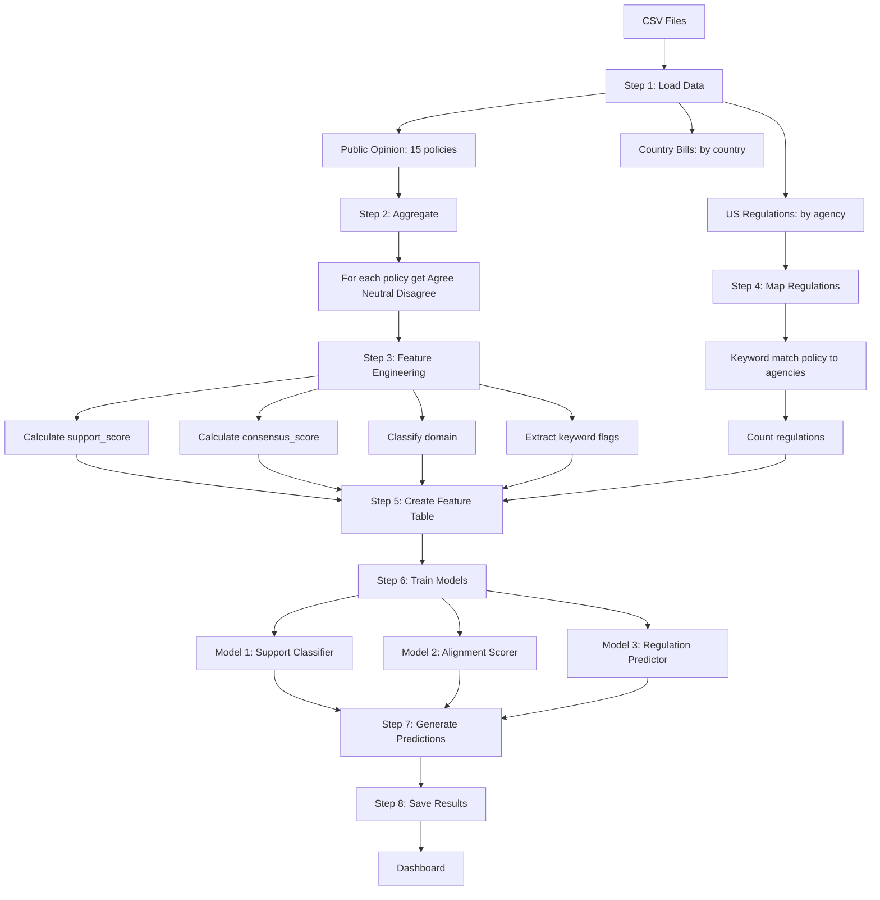

# Simple Data Pipeline Flowchart

## Version 1: Minimal Syntax (Most Compatible)



---

## Version 2: More Detail (Still Simple)



---

## Version 3: Step-by-Step (Most Detailed)



---

## If Mermaid Still Doesn't Work: Use This Text Version

```
DATA PIPELINE FLOWCHART
========================

┌─────────────────────────────────────────────────────────┐
│ STEP 1: LOAD DATA                                        │
├─────────────────────────────────────────────────────────┤
│ • fig_8.2.2.csv → Public Opinion (15 policies)         │
│ • fig_6.2.20.csv → US Regulations (by agency/year)     │
│ • fig_6.2.1.csv → Country Bills (by country)           │
└─────────────────────────────────────────────────────────┘
                          │
                          ▼
┌─────────────────────────────────────────────────────────┐
│ STEP 2: AGGREGATE PUBLIC OPINION                        │
├─────────────────────────────────────────────────────────┤
│ For each of 15 policies:                                │
│ • Extract Agree % (from Label='Agree')                  │
│ • Extract Neutral % (from Label='Neither')             │
│ • Extract Disagree % (from Label='Disagree')           │
└─────────────────────────────────────────────────────────┘
                          │
                          ▼
┌─────────────────────────────────────────────────────────┐
│ STEP 3: FEATURE ENGINEERING                             │
├─────────────────────────────────────────────────────────┤
│ Per Policy:                                             │
│ • support_score = agree_pct - disagree_pct              │
│ • consensus_score = agree_pct + neutral_pct            │
│ • domain = classify(Policy text)                        │
│ • is_privacy, is_employment, etc. (binary flags)       │
│ • has_ban, has_regulation (binary flags)               │
│ • word_count = len(Policy.split())                      │
└─────────────────────────────────────────────────────────┘
                          │
                          ▼
┌─────────────────────────────────────────────────────────┐
│ STEP 4: MAP REGULATORY ACTIVITY                         │
├─────────────────────────────────────────────────────────┤
│ For each policy:                                        │
│ • Keyword match policy → agencies                      │
│ • Sum regulations from matching agencies               │
│ • Result: regulation_count per policy                   │
└─────────────────────────────────────────────────────────┘
                          │
                          ▼
┌─────────────────────────────────────────────────────────┐
│ STEP 5: CREATE FEATURE TABLE                            │
├─────────────────────────────────────────────────────────┤
│ One row per policy with:                                │
│ • 14 features (support metrics, domain, flags)       │
│ • regulation_count                                     │
│ • Target: support_level (Low/Medium/High)              │
└─────────────────────────────────────────────────────────┘
                          │
                          ▼
┌─────────────────────────────────────────────────────────┐
│ STEP 6: TRAIN MODELS                                     │
├─────────────────────────────────────────────────────────┤
│ Model 1: Support Classifier                            │
│ • Algorithm: Random Forest (100 trees)                │
│ • Input: 14 features                                  │
│ • Output: High/Medium/Low                             │
│                                                         │
│ Model 2: Alignment Scorer                              │
│ • Algorithm: Normalized score calculation             │
│ • Formula: norm(agree_pct) - norm(regulation_count)  │
│ • Output: Policy Gap / Aligned / Over-Regulated       │
│                                                         │
│ Model 3: Regulation Predictor                         │
│ • Algorithm: Gradient Boosting                        │
│ • Input: 14 features                                  │
│ • Output: Probability of regulation (0-1)              │
└─────────────────────────────────────────────────────────┘
                          │
                          ▼
┌─────────────────────────────────────────────────────────┐
│ STEP 7: GENERATE PREDICTIONS                            │
├─────────────────────────────────────────────────────────┤
│ • predicted_support_level                             │
│ • alignment_score and alignment_category              │
│ • predicted_regulation_prob                            │
└─────────────────────────────────────────────────────────┘
                          │
                          ▼
┌─────────────────────────────────────────────────────────┐
│ STEP 8: SAVE RESULTS                                     │
├─────────────────────────────────────────────────────────┤
│ • policy_alignment_data.csv                            │
│ • policy_support_model.pkl                             │
│ • regulation_predictor_model.pkl                       │
└─────────────────────────────────────────────────────────┘
                          │
                          ▼
                    [Dashboard]
```
